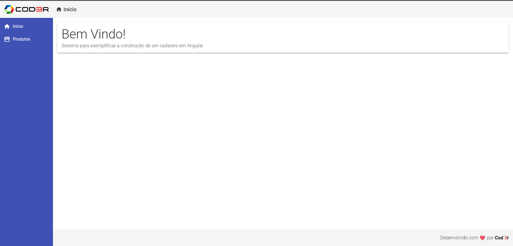
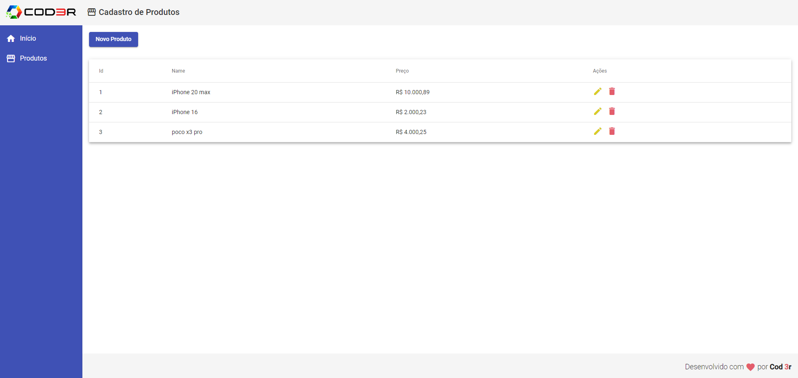
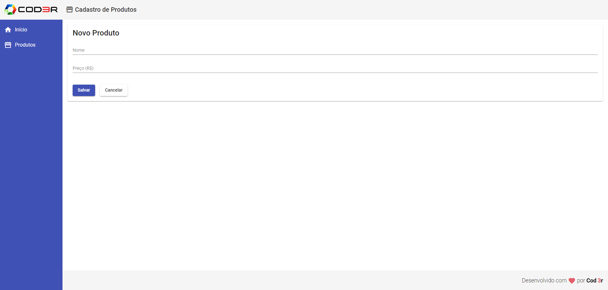
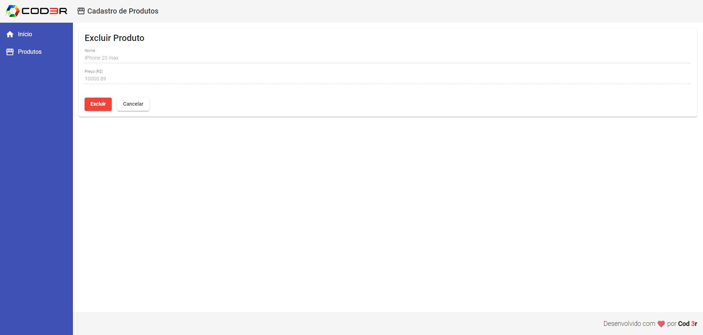

<h1 align="center"> 🎯 Projeto Angular 9 Essencial </h1>

 

  

  

  

  

📚 Tecnologias Utilizadas

 * Angular 9
 * TypeScript
 * HTML5
 * CSS3 / SCSS
 * JavaScript (ES6+)

 💡 Funcionalidades

 * Criação de componentes reutilizáveis.
 * Integração com APIs para buscar e exibir dados.
 * Navegação entre páginas utilizando o Angular Router.
 * Gerenciamento de estado utilizando services e injeção de dependência.
 * Validação de formulários e gerenciamento de eventos.

 

## 💻 Projeto

Este projeto foi desenvolvido como parte do curso Angular 9 Essencial da Cod3r, com o objetivo de aprimorar minhas habilidades no framework Angular e aprender as boas práticas do desenvolvimento front-end. Este é o meu primeiro contato com projetos em Angular, onde explorei vários conceitos importantes para construção de aplicações web robustas e escaláveis.

🚀 Como Rodar o Projeto Localmente

Siga os passos abaixo para rodar o projeto Angular no seu ambiente local:

Clone o repositório:

Primeiro, faça o clone deste repositório para a sua máquina local usando o comando:

git clone https://github.com/seu-usuario/seu-repositorio.git
Entre na pasta do projeto:

Navegue até o diretório do projeto clonado:

Instale as dependências:

npm install

Inicie o servidor de desenvolvimento:

npm start

Acesse o projeto no navegador:

O servidor estará rodando em http://localhost:4200. Abra seu navegador e acesse:

Pronto! O projeto estará rodando no seu ambiente local e você poderá ver as funcionalidades em ação.